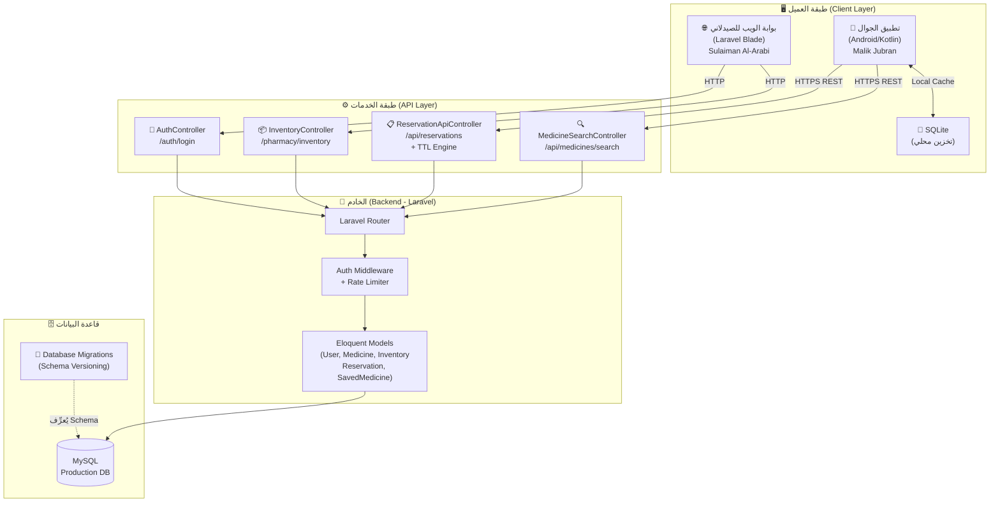
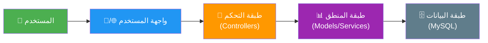
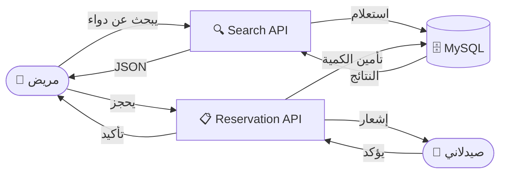

# مخطط معمارية النظام (System Architecture Diagram)

> **PharmaConnect** — هندسة البرمجيات | الفريق 03

---

## Architecture Diagram — المعمارية العامة للنظام

---

## مخطط طبقات المعمارية (Layered Architecture)

---

## توزيع المسؤوليات على الفريق

| الطبقة | المكوّن | المسؤول |
|:---|:---|:---|
| **Mobile Client** | تطبيق الجوال + SQLite | مالك جبران |
| **Web Portal** | لوحة تحكم الصيدلاني | سليمان العربي |
| **Backend API** | Controllers + TTL Engine | يعقوب المهاجري |
| **Database** | Migrations + Schema | يعقوب المهاجري |

---

## تدفق البيانات الرئيسي

