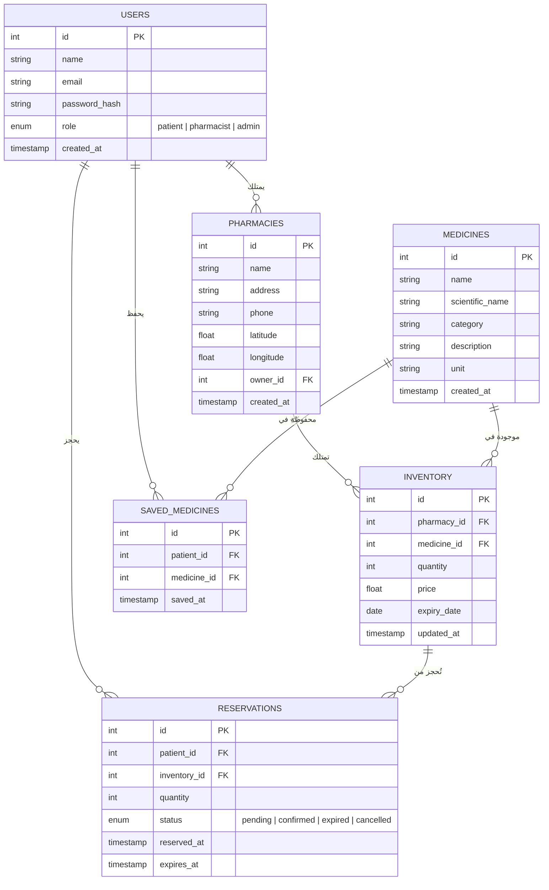

# مخطط قاعدة البيانات (Entity-Relationship Diagram)

> **PharmaConnect** — هندسة البرمجيات | الفريق 03

---

## ERD — مخطط العلاقات بين الكيانات

---

## وصف الكيانات

| الكيان | الوصف |
|:---|:---|
| **USERS** | المستخدمون (مريض، صيدلاني، مشرف) |
| **PHARMACIES** | الصيدليات المسجلة في النظام |
| **MEDICINES** | كتالوج الأدوية المرجعي |
| **INVENTORY** | مخزون كل دواء في كل صيدلية مع السعر والكمية |
| **RESERVATIONS** | الحجوزات مع نظام TTL (انتهاء في 30 دقيقة) |
| **SAVED_MEDICINES** | قائمة الأدوية المحفوظة محلياً لكل مريض |

---

## العلاقات الرئيسية

- **مستخدم واحد** يمكنه امتلاك **صيدلية واحدة** (صيدلاني) أو **حجوزات متعددة** (مريض).
- **صيدلية واحدة** لها **مخزون متعدد** من الأدوية المختلفة.
- **دواء واحد** يمكن أن يكون موجوداً في **صيدليات متعددة** بأسعار وكميات مختلفة.
- **الحجز** يرتبط بسجل **مخزون محدد** ويتضمن تاريخ انتهاء تلقائي.
