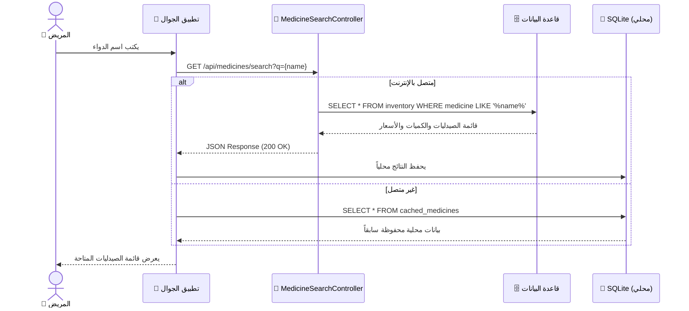
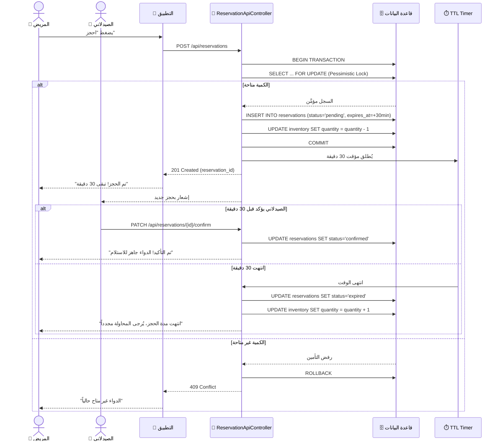
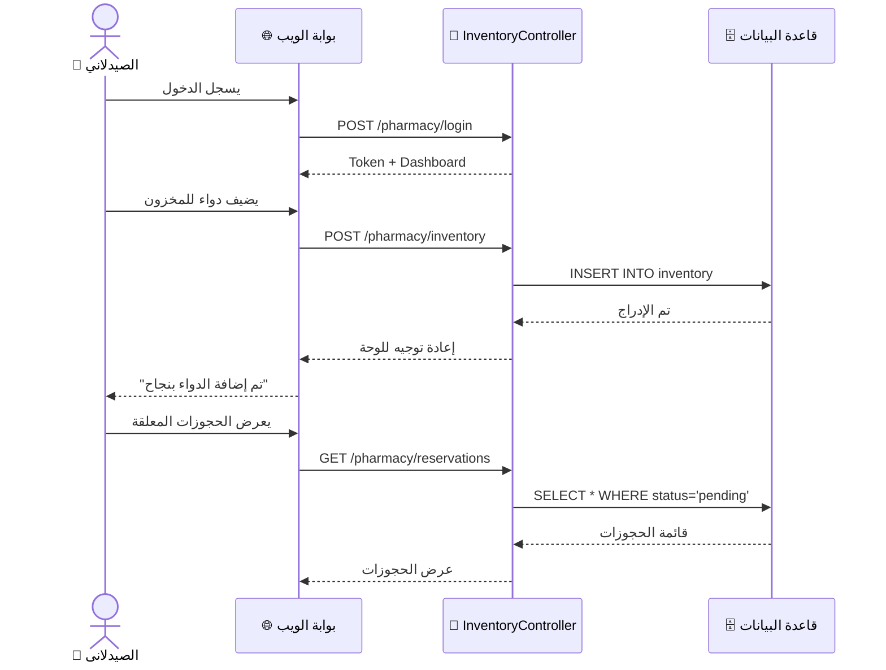

# مخطط التسلسل (Sequence Diagrams)

> **PharmaConnect** — هندسة البرمجيات | الفريق 03

---

## Sequence Diagram 1: البحث عن دواء وعرض النتائج

---

## Sequence Diagram 2: حجز دواء بنظام TTL (30 دقيقة)

---

## Sequence Diagram 3: إدارة المخزون (الصيدلاني)

