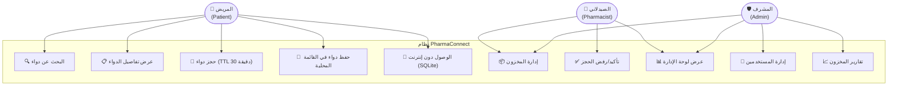

# مخططات حالات الاستخدام (Use Case Diagrams)

> **PharmaConnect** — هندسة البرمجيات | الفريق 03

---

## Use Case Diagram — الأدوار والوظائف الرئيسية

---

## Use Case التفصيلي: البحث عن الدواء

| العنصر | التفاصيل |
|:---|:---|
| **المعرّف** | UC-01 |
| **الاسم** | البحث عن دواء |
| **الفاعل الأساسي** | المريض |
| **المتطلب المرتبط** | FR-01 |
| **الوصف** | يبحث المريض عن دواء بالاسم أو المادة الفعالة |
| **الشرط المسبق** | المستخدم متصل بالإنترنت أو يملك بيانات محلية |
| **التدفق الأساسي** | 1. يدخل المريض اسم الدواء → 2. يعرض النظام قائمة بالصيدليات المتاحة → 3. يختار المريض الصيدلية → 4. يعرض التفاصيل والسعر والكمية |
| **التدفق البديل** | إذا لم يُوجد الدواء → يعرض رسالة "غير متاح حالياً" |
| **حالات الحافة** | اسم ناقص، دواء منتهي الصلاحية، لا يوجد إنترنت |
| **الشرط اللاحق** | يعرض النظام نتائج دقيقة |

---

## Use Case التفصيلي: حجز الدواء بنظام TTL

| العنصر | التفاصيل |
|:---|:---|
| **المعرّف** | UC-03 |
| **الاسم** | حجز دواء |
| **الفاعل الأساسي** | المريض |
| **الفاعل الثانوي** | الصيدلاني |
| **المتطلب المرتبط** | FR-03, FR-04 |
| **الوصف** | يحجز المريض دواءً ويتم تأمينه لمدة 30 دقيقة |
| **التدفق الأساسي** | 1. يضغط "احجز" → 2. يُقفل النظام الكمية (Pessimistic Lock) → 3. يُرسل إشعاراً للصيدلاني → 4. يُؤكد الصيدلاني → 5. يُغلق الحجز بنجاح |
| **التدفق البديل** | إذا انتهت 30 دقيقة → يُلغى الحجز تلقائياً وتُعاد الكمية |
| **حالات الحافة** | نفاد المخزون، انقطاع الشبكة، إلغاء المريض |
